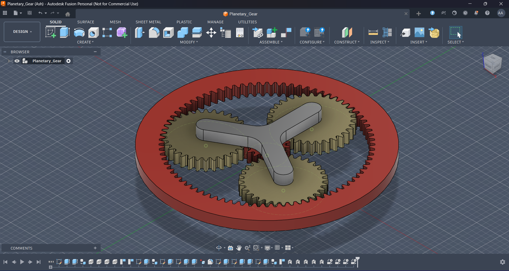
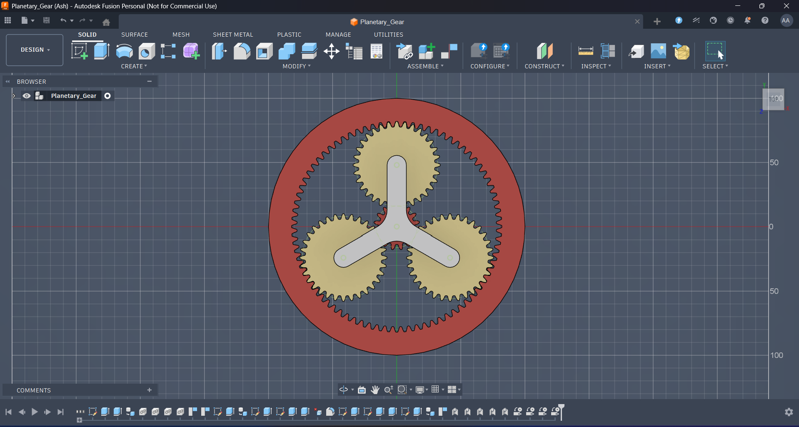

# 🔧 Planetary Gear Actuation System (Fusion 360)

## 📌 Overview
This project demonstrates the design of a **planetary gear mechanism** using Fusion 360, intended for applications requiring **compact, high-torque, and smooth rotational motion**.

The system follows a **sun–planet–ring configuration**, commonly used in robotics, automotive transmissions, and precision motion systems.

---

## ⚙️ Key Features

- 🌀 **Sun Gear** – Central driving gear  
- ⚙️ **Planet Gears (3x)** – Even load distribution and smooth motion  
- 🔵 **Ring Gear (Internal Teeth)** – Compact and efficient design  
- 🔗 **Carrier Mechanism** – Transfers output rotation  

---

## 🎯 Applications

This mechanism is suitable for:

- 🤖 **Robotic arm joints**
- ⚙️ Precision motion control systems  
- 🚗 Automotive transmission systems  
- 🏭 Industrial automation  

---

## 🚀 Design Objectives

- Achieve **high torque output in a compact structure**  
- Ensure **smooth and stable rotational motion**  
- Enable **controlled speed reduction**  
- Support **real-world motor integration**

---

## 🧠 Working Principle

In this system:

1. The **sun gear** acts as the input  
2. The **planet gears** rotate around the sun gear  
3. The **ring gear** provides internal engagement  
4. The **carrier** transfers the output motion  

This arrangement allows:
- Torque amplification  
- Speed reduction  
- Balanced load distribution  

---

## 🛠️ Tools Used

- Autodesk Fusion 360 (CAD Design)

---

## 🔄 Future Improvements

- Motor integration for real-world testing  
- Gear ratio optimization  
- Load and torque analysis  
- Bearing and shaft design  
- Simulation and motion analysis  

---

## 📷 Preview

---

## 🤝 Contributions

Open to suggestions, improvements, and collaboration!

---

## 📬 Contact

Feel free to connect or reach out for discussions on design, robotics, and embedded systems.
